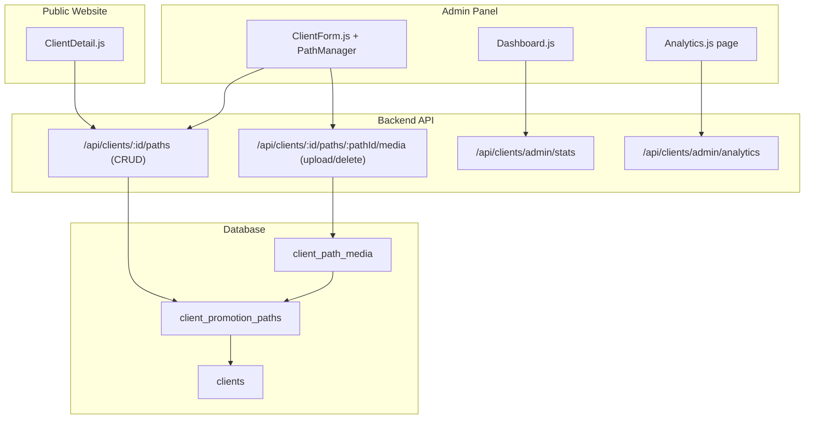

# Design Document: Client Promotion Paths

## Overview

This feature extends the existing client management platform with a **Promotion Paths** system. Each client can own multiple named promotion paths (campaigns/projects), each holding up to 5 images and 5 videos. The feature spans four layers:

1. **Database** — two new tables (`client_promotion_paths`, `client_path_media`)
2. **Backend API** — new Express routes for CRUD on paths, media upload/delete, admin stats, and analytics
3. **Admin Panel** — a `PathManager` component embedded in `ClientForm.js`, a new `Analytics` page, and three new stat cards on `Dashboard.js`
4. **Public Website** — `ClientDetail.js` updated to render a "Promotion Paths" section

The design reuses existing patterns already established in the codebase: the `upload` middleware (multer), the `auth` middleware for protected routes, the `client_media` table structure for media, and the React inline-style component pattern used throughout the admin panel.

---

## Architecture



**Key design decisions:**

- Path media files are routed to `uploads/paths/` by extending the existing `upload.js` middleware detection logic (checking `req.baseUrl` for `/paths`), keeping file organisation consistent with existing `uploads/images/` and `uploads/videos/` directories.
- The `/admin/stats` and `/admin/analytics` routes are placed on the existing `clients` router. Because Express matches routes in registration order, these `/admin/*` routes must be registered **before** the `/:id` wildcard route to avoid being swallowed by it.
- The Analytics page is a new top-level route `/analytics` in the admin panel, added to both `App.js` and `Layout.js`.

---

## Components and Interfaces

### Backend Routes

#### `GET /api/clients/admin/stats`
Returns aggregate counts in a single response.

```json
{
  "totalPaths": 42,
  "totalImages": 130,
  "totalVideos": 87
}
```

#### `GET /api/clients/admin/analytics`
Accepts optional query parameters: `location`, `date` (YYYY-MM-DD), `month` (1–12), `year` (YYYY).
Returns filtered client list and count.

```json
{
  "count": 5,
  "clients": [ { "id": 1, "name": "...", "location": "...", "created_at": "..." } ]
}
```

#### `GET /api/clients/:id/paths`
Returns all promotion paths for a client, ordered by `path_date DESC`, each including its media.

```json
[
  {
    "id": 1,
    "client_id": 7,
    "title": "Summer Campaign",
    "path_date": "2024-06-01",
    "created_at": "...",
    "images": [ { "id": 1, "url": "...", "description": "..." } ],
    "videos": [ { "id": 2, "url": "...", "description": "..." } ]
  }
]
```

#### `POST /api/clients/:id/paths`
Body: `{ title, path_date }`. Returns created path (HTTP 201). Returns HTTP 400 if `title` is missing.

#### `PUT /api/clients/:id/paths/:pathId`
Body: `{ title?, path_date? }`. Returns updated path.

#### `DELETE /api/clients/:id/paths/:pathId`
Deletes path record, all `client_path_media` records, and all associated files from disk via `ON DELETE CASCADE` + explicit file cleanup.

#### `POST /api/clients/:id/paths/:pathId/media`
Multipart upload (`file` field). Enforces 5-image / 5-video limits per path. Returns HTTP 400 with specific message on limit breach.

#### `DELETE /api/clients/:id/paths/:pathId/media/:mediaId`
Deletes the DB record and the file from disk.

---

### Admin Panel Components

#### `PathManager` (new component, embedded in `ClientForm.js`)
Props: `clientId: string | number`

State:
- `paths: Path[]` — list of promotion paths
- `expanded: number | null` — which path's media panel is open
- `creating: boolean` — show create form
- `newPath: { title, path_date }` — controlled form state
- `uploading: string | null` — `'image' | 'video' | null`

Responsibilities:
- Fetch and display all paths for the client on mount
- Create / edit / delete paths
- Upload / delete path media (images and videos)
- Show `X/5 images, Y/5 videos` counts per path

#### `Analytics` (new page, `admin-panel/src/pages/Analytics.js`)
State:
- `location: string` — selected city filter
- `date: string`, `month: string`, `year: string` — date filter controls
- `results: Client[]`, `count: number`

Fetches from `GET /api/clients/admin/analytics` with current filter params on filter change.

#### `Dashboard.js` updates
Three new stat cards added to the existing `cards` array, populated from a single call to `GET /api/clients/admin/stats`:
- Total Promotion Paths (icon 🛣️, color `#06b6d4`)
- Total Path Images (icon 🖼️, color `#8b5cf6`)
- Total Path Videos (icon 🎬, color `#ec4899`)

---

### Public Website

#### `ClientDetail.js` updates
After the existing Videos section, a new "Promotion Paths" section is rendered if `client.promotionPaths?.length > 0`. The `getClientFull` helper in `clients.js` is extended to also fetch and attach `promotionPaths` to the client object.

Each path renders:
- A heading with the path title and formatted date
- An image grid (same style as the existing images grid)
- A video list (same style as the existing videos list)

---

## Data Models

### `client_promotion_paths`

| Column | Type | Notes |
|---|---|---|
| `id` | INT UNSIGNED AUTO_INCREMENT PK | |
| `client_id` | INT UNSIGNED NOT NULL | FK → `clients(id)` ON DELETE CASCADE |
| `title` | VARCHAR(300) NOT NULL | |
| `path_date` | DATE | |
| `created_at` | TIMESTAMP DEFAULT CURRENT_TIMESTAMP | |
| `updated_at` | TIMESTAMP DEFAULT CURRENT_TIMESTAMP ON UPDATE CURRENT_TIMESTAMP | |

### `client_path_media`

| Column | Type | Notes |
|---|---|---|
| `id` | INT UNSIGNED AUTO_INCREMENT PK | |
| `path_id` | INT UNSIGNED NOT NULL | FK → `client_promotion_paths(id)` ON DELETE CASCADE |
| `type` | ENUM('image','video') NOT NULL | |
| `file_path` | VARCHAR(500) NOT NULL | relative path on disk |
| `description` | VARCHAR(500) DEFAULT '' | |
| `sort_order` | INT DEFAULT 0 | |
| `created_at` | TIMESTAMP DEFAULT CURRENT_TIMESTAMP | |

### SQL Migration (to append to `allthings_db.sql`)

```sql
-- ─────────────────────────────────────────────
-- Table: client_promotion_paths
-- ─────────────────────────────────────────────
CREATE TABLE IF NOT EXISTS `client_promotion_paths` (
  `id`         INT UNSIGNED AUTO_INCREMENT PRIMARY KEY,
  `client_id`  INT UNSIGNED NOT NULL,
  `title`      VARCHAR(300) NOT NULL,
  `path_date`  DATE,
  `created_at` TIMESTAMP DEFAULT CURRENT_TIMESTAMP,
  `updated_at` TIMESTAMP DEFAULT CURRENT_TIMESTAMP ON UPDATE CURRENT_TIMESTAMP,
  FOREIGN KEY (`client_id`) REFERENCES `clients`(`id`) ON DELETE CASCADE
) ENGINE=InnoDB DEFAULT CHARSET=utf8mb4;

-- ─────────────────────────────────────────────
-- Table: client_path_media
-- ─────────────────────────────────────────────
CREATE TABLE IF NOT EXISTS `client_path_media` (
  `id`          INT UNSIGNED AUTO_INCREMENT PRIMARY KEY,
  `path_id`     INT UNSIGNED NOT NULL,
  `type`        ENUM('image','video') NOT NULL,
  `file_path`   VARCHAR(500) NOT NULL,
  `description` VARCHAR(500) DEFAULT '',
  `sort_order`  INT DEFAULT 0,
  `created_at`  TIMESTAMP DEFAULT CURRENT_TIMESTAMP,
  FOREIGN KEY (`path_id`) REFERENCES `client_promotion_paths`(`id`) ON DELETE CASCADE
) ENGINE=InnoDB DEFAULT CHARSET=utf8mb4;
```

---

## Correctness Properties

*A property is a characteristic or behavior that should hold true across all valid executions of a system — essentially, a formal statement about what the system should do. Properties serve as the bridge between human-readable specifications and machine-verifiable correctness guarantees.*

### Property 1: Path creation round-trip

*For any* valid `(title, path_date)` pair submitted to `POST /api/clients/:id/paths`, the API should return HTTP 201 and the response object should contain the same `title` and `path_date` that were submitted, and a subsequent `GET /api/clients/:id/paths` should include that path.

**Validates: Requirements 1.1, 2.1**

---

### Property 2: Missing title is rejected

*For any* create-path request that omits the `title` field (or sends an empty string), the API should return HTTP 400 with a non-empty error message.

**Validates: Requirements 2.2**

---

### Property 3: Path update round-trip

*For any* existing promotion path and any valid update payload `{ title?, path_date? }`, after a successful `PUT` the returned object should reflect the new values, and a subsequent `GET` should return the same updated values.

**Validates: Requirements 2.3**

---

### Property 4: Path delete cascades to media and files

*For any* promotion path that has associated `client_path_media` records, after a successful `DELETE /api/clients/:id/paths/:pathId`, neither the path record nor any of its media records should exist in the database.

**Validates: Requirements 1.4, 2.4**

---

### Property 5: No upper limit on paths per client

*For any* client, creating more than 10 promotion paths should succeed — all paths should be stored and returned by `GET /api/clients/:id/paths`.

**Validates: Requirements 1.5**

---

### Property 6: Paths are ordered by path_date descending

*For any* client with multiple promotion paths having distinct `path_date` values, the list returned by `GET /api/clients/:id/paths` should be sorted so that each path's `path_date` is greater than or equal to the next path's `path_date`.

**Validates: Requirements 2.5, 4.6**

---

### Property 7: Media upload round-trip

*For any* promotion path with fewer than 5 items of a given type (`image` or `video`), uploading a file of that type should succeed (HTTP 201) and the returned media object should be retrievable in the path's media list with the correct `type` field.

**Validates: Requirements 1.3, 3.1, 3.3**

---

### Property 8: Media per-type limit is enforced

*For any* promotion path that already has exactly 5 items of a given type (`image` or `video`), any further upload of that type should return HTTP 400 with the message `"Maximum 5 images per path reached."` or `"Maximum 5 videos per path reached."` respectively.

**Validates: Requirements 3.2, 3.4**

---

### Property 9: Media delete removes record

*For any* existing `client_path_media` record, after a successful `DELETE /api/clients/:id/paths/:pathId/media/:mediaId`, that record should no longer appear in the path's media list.

**Validates: Requirements 3.5**

---

### Property 10: Path media counts are accurate

*For any* promotion path, the image count and video count displayed by the PathManager (sourced from the API response) should equal the actual number of `client_path_media` records of each type for that path.

**Validates: Requirements 3.6**

---

### Property 11: Client detail includes all path data

*For any* client with promotion paths, the response from `GET /api/clients/:id` should include a `promotionPaths` array where each entry contains `title`, `path_date`, `images`, and `videos`.

**Validates: Requirements 4.1**

---

### Property 12: Path render contains title and date

*For any* promotion path object with a `title` and `path_date`, the rendered HTML/JSX output for that path should contain the title string and a representation of the date, and should include all image URLs and video URLs belonging to that path.

**Validates: Requirements 4.3, 4.4, 4.5**

---

### Property 13: Stats endpoint accuracy

*For any* database state, the response from `GET /api/clients/admin/stats` should return `totalPaths` equal to `COUNT(*) FROM client_promotion_paths`, `totalImages` equal to `COUNT(*) FROM client_path_media WHERE type='image'`, and `totalVideos` equal to `COUNT(*) FROM client_path_media WHERE type='video'`.

**Validates: Requirements 5.1, 5.2, 5.3, 5.5**

---

### Property 14: Location filter returns only matching clients

*For any* location string applied as a filter to `GET /api/clients/admin/analytics?location=X`, every client in the returned `clients` array should have `location` equal to `X`.

**Validates: Requirements 6.3**

---

### Property 15: Date filter returns only matching clients

*For any* date filter applied to `GET /api/clients/admin/analytics` (via `date`, `month`, or `year` query params), every client in the returned `clients` array should have a `created_at` value that falls within the specified time range.

**Validates: Requirements 6.4, 6.5, 6.6**

---

### Property 16: Analytics count equals results length

*For any* filter state, the `count` field in the analytics response should equal the length of the `clients` array in the same response.

**Validates: Requirements 6.7**

---

## Error Handling

| Scenario | HTTP Status | Response |
|---|---|---|
| Create path without `title` | 400 | `{ message: "Title is required." }` |
| Upload image when path already has 5 images | 400 | `{ message: "Maximum 5 images per path reached." }` |
| Upload video when path already has 5 videos | 400 | `{ message: "Maximum 5 videos per path reached." }` |
| Upload unsupported file type | 400 | `{ message: "Only images (jpg, png, webp) and videos (mp4, mov, webm) are allowed." }` (from existing multer filter) |
| Path not found (GET/PUT/DELETE) | 404 | `{ message: "Path not found." }` |
| Media not found (DELETE) | 404 | `{ message: "Media not found." }` |
| Client not found | 404 | `{ message: "Client not found." }` |
| Unauthenticated request to protected route | 401 | `{ message: "Unauthorized." }` (from existing `auth` middleware) |
| Database / server error | 500 | `{ message: "Server error." }` |

File cleanup on delete uses `fs.existsSync` + `fs.unlinkSync` (same pattern as existing `DELETE /api/clients/:id/media/:mediaId`). If the file is already missing from disk, the deletion proceeds silently without error.

---

## Testing Strategy

### Dual Testing Approach

Both unit tests and property-based tests are required. They are complementary:
- **Unit tests** cover specific examples, integration points, and edge cases
- **Property tests** verify universal correctness across randomly generated inputs

### Unit Tests

Focus areas:
- `POST /api/clients/:id/paths` with valid and invalid bodies (missing title, missing path_date)
- `DELETE /api/clients/:id/paths/:pathId` verifying cascade: path gone, media gone
- `POST /api/clients/:id/paths/:pathId/media` at exactly the 5-item limit (boundary condition)
- `GET /api/clients/admin/stats` returns all three fields with correct types
- `GET /api/clients/admin/analytics` with each filter type in isolation and combined
- Analytics response when no clients match (count: 0, clients: [])
- Analytics response with no filters (returns all clients)
- `GET /api/clients/:id` includes `promotionPaths` array

### Property-Based Tests

**Library**: [fast-check](https://github.com/dubzzz/fast-check) (JavaScript, consistent with the existing React/Node.js stack)

**Configuration**: minimum 100 runs per property (`{ numRuns: 100 }`)

**Tag format**: `// Feature: client-promotion-paths, Property N: <property_text>`

Each correctness property maps to exactly one property-based test:

| Property | Test description |
|---|---|
| P1 | Arbitrary valid title/date → create → GET confirms presence |
| P2 | Arbitrary request with empty/missing title → always 400 |
| P3 | Arbitrary path + arbitrary update payload → PUT → GET confirms new values |
| P4 | Arbitrary path with N media items → DELETE path → no records remain |
| P5 | Create 11–20 paths for one client → all returned |
| P6 | Arbitrary list of paths with distinct dates → GET order is date DESC |
| P7 | Arbitrary path with 0–4 media of a type → upload → appears in list |
| P8 | Arbitrary path at exactly 5 of a type → upload → 400 with correct message |
| P9 | Arbitrary media item → DELETE → not in list |
| P10 | Arbitrary path state → counts in response match actual DB counts |
| P11 | Arbitrary client with paths → GET client → promotionPaths present with all fields |
| P12 | Arbitrary path object → render function → output contains title, date, all media URLs |
| P13 | Arbitrary DB state → GET /admin/stats → counts match direct DB queries |
| P14 | Arbitrary location string → GET analytics?location=X → all results have location=X |
| P15 | Arbitrary date/month/year filter → GET analytics → all results within range |
| P16 | Arbitrary filter state → count field equals clients array length |
